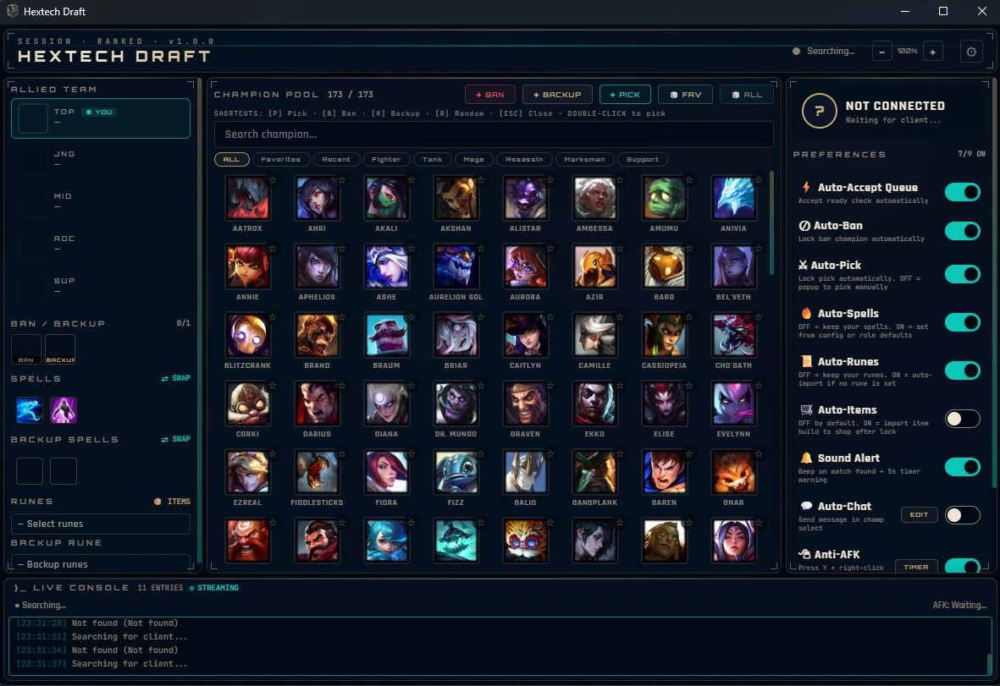

# ⚔️ Hextech Draft — League Auto-Accept (Enhanced Menu)

[](https://github.com/jimman0I/League-Auto-Accept-Enhanced-Menu/releases/latest)
[](https://github.com/jimman0I/League-Auto-Accept-Enhanced-Menu/releases)
[](LICENSE)
[](https://github.com/jimman0I/League-Auto-Accept-Enhanced-Menu/stargazers)

A lightweight Windows desktop app that talks to the **League of Legends Client API (LCU)** to automate the boring parts of getting into a game — accepting queues, picking/banning, applying runes & spells, and more — wrapped in a clean, themeable Hextech-styled interface.

It interacts **only** with Riot's official local client API (`lockfile` auth over the documented REST endpoints). It does **not** read or write game memory, inject DLLs, or modify client files.



---

## ✨ Features

- 🟢 **Auto Accept** — instantly accepts ready checks / matchmaking queues
- 🎯 **Auto Pick & Ban** — selects and **locks in** your preferred champion per role, with tag filters and favorites
- 📖 **Auto Runes** — fetches recommended rune pages from **U.GG** and applies them after lock-in
- ✨ **Auto Spells** — applies your preset summoner spells (with one-click swap)
- 🛒 **Item Builds** — pulls recommended builds from your choice of **U.GG**, **Blitz.gg**, or **Lolalytics**
- 💬 **Auto Chat** — sends custom messages in champion select
- 🛡️ **Anti-AFK** — prevents idle disconnects
- 🚪 **Dodge** — bail out of a lobby in one click
- 🧩 **Per-Role Configs** — independent picks, bans, runes, and spells for every position
- 🎨 **Themes & Zoom** — light / lite modes and adjustable UI scale
- 🌍 **Region Aware** — set your region for build lookups
- 💾 **Persistent Config** — settings saved to `lol_config.json` between sessions
- ⬆️ **Built-in Auto-Update** — checks GitHub Releases on launch and updates itself in place (see below)

## 🚀 Quick Start (no Python needed)

1. Download the latest **`HextechDraft.exe`** from the [**Releases**](https://github.com/jimman0I/League-Auto-Accept-Enhanced-Menu/releases/latest) page.
2. Launch the League of Legends client and log in.
3. Run `HextechDraft.exe`. It auto-connects to your running client.
4. On first launch, pick your item build source. Configure picks, bans, runes, spells, and toggles in the UI.
5. Leave it running — it acts automatically at the right moments.

> **First-run warning:** because the exe isn't code-signed, Windows SmartScreen may show *"Windows protected your PC"* the first time you run it. Click **More info → Run anyway**. This is expected for small open-source tools and the prompt goes away on its own as more people download it.

## ⬆️ Auto-Update

You don't need to re-download the app to get new versions. On every launch, Hextech Draft quietly checks this repo's GitHub Releases. When a newer release is published, an **"⬆ UPDATE AVAILABLE"** banner appears in the header — click it and the app downloads the new `.exe`, swaps itself out, and restarts. No manual reinstall required.

> Maintainer note: to ship an update, bump `APP_VERSION` in `hextech_auto_accept.py`, rebuild the exe, and publish a new GitHub Release whose tag matches the version (e.g. `v1.0.1`) with the `.exe` attached as a release asset.

## 🛠️ Run / Build from Source

```bash
# Python 3.10+ on Windows
pip install -r requirements.txt

# Run directly
python hextech_auto_accept.py

# Or build a standalone exe (output: dist/HextechDraft.exe)
build_exe.bat
```

## ⚙️ How It Works

The app discovers the running League client via its `lockfile`, authenticates against the local LCU REST API, and polls the game-flow phase (`ReadyCheck`, `ChampSelect`, `InProgress`). Each automation is triggered at the correct phase, so everything happens hands-free.

## ⚠️ Disclaimer

This is a third-party convenience tool that uses only the official, documented LCU endpoints — no memory reads, no DLL injection, no client file modification.

That said, Riot's Terms of Service restrict "automation of any process normally performed by the player." Auto-accept and rune/spell/build import are widely used and generally low-risk conveniences. **Auto-pick, auto-ban, and auto-chat automate actual gameplay decisions and sit closer to that line** — Riot has not endorsed this tool, and using automated pick/ban carries real (if inconsistently enforced) account-action risk. Toggle those features off if you want to stay clearly on the safe side; they're opt-in, not required for the rest of the app to work.

The champ-select **personal winrate display** (per-champion win rate pulled from your own match history) falls under the same restriction — Riot staff have flagged in-client winrate/stat overlays generally, not just automation, as against the rules. Same disclaimer applies: use at your own risk.

## 🧰 Tech Stack

`Python 3` • `pywebview` • `requests` • `psutil` • `LCU REST API` • `PyInstaller`

## 📄 License

[MIT](LICENSE) © jimman0I
