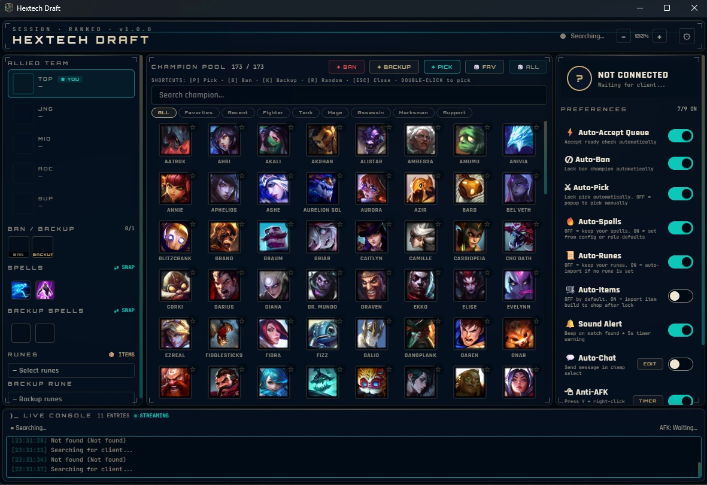

<div align="center">


# ⚔️ Hextech Draft — League of Legends Auto-Accept, Smart Pick &amp; Champ-Select Automation



<br/>

[](https://github.com/jimman0I/League-Auto-Accept-Enhanced-Menu/releases/latest)
[](https://github.com/jimman0I/League-Auto-Accept-Enhanced-Menu/releases)

[](LICENSE)


<br/>

**Auto-Accept** · **Smart Pick** · **Lane-aware champion pool** · **Per-role runes, spells &amp; item builds** · **Anti-AFK**

[**⬇️ Download for Windows**](https://github.com/jimman0I/League-Auto-Accept-Enhanced-Menu/releases/latest) &nbsp;·&nbsp; [Quick start](#quick-start) &nbsp;·&nbsp; [Features](#-features) &nbsp;·&nbsp; [Report a bug](https://github.com/jimman0I/League-Auto-Accept-Enhanced-Menu/issues/new)

</div>

<br/>

> League's own client makes you sit through a ready-check click, a lane-dependent
> champion decision, a rune page, a spell set and an item-shop build — every
> single game. **Hextech Draft watches the client's own phase state and does
> each of those the moment it's legal to**, using only Riot's documented LCU
> REST API.

It talks **only** to `127.0.0.1` through the League client's own lockfile-authenticated
API. No memory reads, no DLL injection, no client file modification — if you can see
it in the UI, it's one documented endpoint call away.

<div align="center">



<br/>
<br/>

### ⭐ If this saves you a click every game, star the repo — it helps others find it.

[](https://github.com/jimman0I/League-Auto-Accept-Enhanced-Menu)

</div>

<br/>

## 🎬 How It Works



The app discovers the running League client via its `lockfile`, authenticates
against the local LCU REST API, and polls the game-flow phase (`ReadyCheck`,
`ChampSelect`, `InProgress`). Each automation fires the moment its phase is
legal — nothing is simulated, nothing is pre-timed, it's all driven by the
client's own state.

<br/>

## ✨ Features

| | |
| --- | --- |
| 🟢 **Auto-Accept** | Instantly accepts ready checks / matchmaking queues — no more missed pops |
| 🧠 **Smart Pick** | Weighs your team comp, lane, and the enemy's picks live, then suggests (or auto-locks) a champion — free, no API key, no LLM |
| 🗺️ **Lane-Aware Champion Pool** | The grid filters by Top / Jungle / Mid / ADC / Support instead of generic class tags — click a role, see who's actually played there |
| ★ **Favorites, Global or Per-Lane** | Right-click any champion to favorite them globally or for one specific lane; they show up in that lane's tab *and* count as a Smart Pick candidate, without leaving their usual lane |
| 🎯 **Auto Pick &amp; Ban** | Selects and **locks in** your preferred champion per role |
| 📖 **Auto Runes** | Fetches a recommended rune page and applies it after lock-in |
| ✨ **Auto Spells** | Applies your preset summoner spells, with one-click swap |
| 🛒 **Item Builds, Your Way** | Pulls recommended builds from **U.GG**, **Blitz.gg**, or **Lolalytics** — or override per-role with a 6-category build style (Tank / Bruiser / AP / Burst-Assassin / AD-Carry / Utility), computed locally from item tags, no network judgment call needed |
| 💬 **Auto Chat** | Sends a custom message in champion select |
| 🛡️ **Anti-AFK** | Prevents idle disconnects while you're reading a build |
| 🚪 **Dodge** | Bail out of a lobby in one click |
| 🧩 **Per-Role Configs** | Independent picks, bans, runes, spells and build styles for every position |
| 🎨 **Themes &amp; Zoom** | Light / lite modes and an adjustable UI scale |
| 🌍 **Region Aware** | Set your region once for build lookups |
| 💾 **Persistent Config** | Everything saved to `lol_config.json` between sessions |
| ⬆️ **Built-in Auto-Update** | Checks GitHub Releases on launch and updates itself in place |

<br/>

<a id="quick-start"></a>

## 🚀 Quick Start (no Python needed)

1. Download the latest **`HextechDraft.exe`** from the [**Releases**](https://github.com/jimman0I/League-Auto-Accept-Enhanced-Menu/releases/latest) page.
2. Launch the League of Legends client and log in.
3. Run `HextechDraft.exe`. It auto-connects to your running client.
4. On first launch, pick your item build source. Configure picks, bans, runes, spells and toggles in the UI.
5. Leave it running — it acts automatically at the right moments.

> **First-run warning:** because the exe isn't code-signed, Windows SmartScreen may show *"Windows protected your PC"* the first time you run it. Click **More info → Run anyway**. This is expected for small open-source tools and the prompt goes away on its own as more people download it.

## ⬆️ Auto-Update

You don't need to re-download the app to get new versions. On every launch, Hextech Draft quietly checks this repo's GitHub Releases. When a newer release is published, an **"⬆ UPDATE AVAILABLE"** banner appears in the header — click it and the app downloads the new `.exe`, swaps itself out, and restarts. No manual reinstall required.

> Maintainer note: to ship an update, bump `APP_VERSION` in `hextech_auto_accept.py`, rebuild the exe, and publish a new GitHub Release whose tag matches the version (e.g. `v1.1.0`) with the `.exe` attached as a release asset.

## 🛠️ Run / Build from Source

```bash
# Python 3.10+ on Windows
pip install -r requirements.txt

# Run directly
python hextech_auto_accept.py

# Or build a standalone exe (output: dist/HextechDraft.exe)
build_exe.bat
```

## ⚠️ Disclaimer

This is a third-party convenience tool that uses only the official, documented LCU endpoints — no memory reads, no DLL injection, no client file modification.

That said, Riot's Terms of Service restrict "automation of any process normally performed by the player." Auto-accept and rune/spell/build import are widely used and generally low-risk conveniences. **Auto-pick, auto-ban, and auto-chat automate actual gameplay decisions and sit closer to that line** — Riot has not endorsed this tool, and using automated pick/ban carries real (if inconsistently enforced) account-action risk. Toggle those features off if you want to stay clearly on the safe side; they're opt-in, not required for the rest of the app to work.

The champ-select **personal winrate display** (per-champion win rate pulled from your own match history) falls under the same restriction — Riot staff have flagged in-client winrate/stat overlays generally, not just automation, as against the rules. Same disclaimer applies: use at your own risk.

## 🧰 Tech Stack

`Python 3` • `pywebview` • `requests` • `psutil` • `LCU REST API` • `PyInstaller`

## 📄 License

[MIT](LICENSE) © jimman0I
